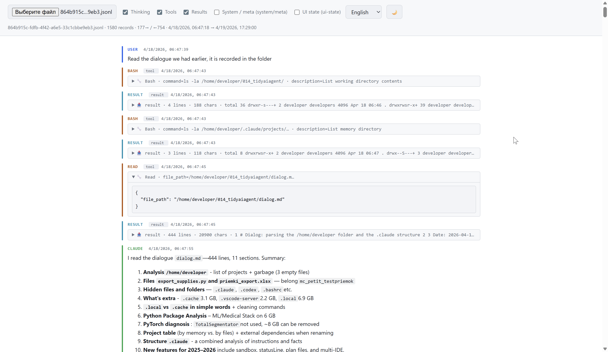

<p align="center">
  <a href="https://hitmman55.github.io/claude-code-chat-viewer/">
    
  </a>
</p>
<p align="center"><i>Just click — no install, no build, no signup.</i></p>

<p align="center">
  <b>English</b> ·
  <a href="README.ru.md">Русский</a> ·
  <a href="README.es.md">Español</a> ·
  <a href="README.fr.md">Français</a> ·
  <a href="README.zh-CN.md">中文</a> ·
  <a href="README.ar.md">العربية</a>
</p>

# Claude Code Chat Viewer

<p align="center">
  
  
  
  
</p>

<p align="center">
  
</p>

HTML viewer for [Claude Code](https://claude.com/claude-code) session transcripts in JSONL format. Opens in a browser — no server, no build step, one vendored dependency. Works offline out of the box.

## Why

Claude Code writes every session to `~/.claude/projects/<project>/<session-uuid>.jsonl` — one line per record (user message, model reply, thinking, tool_use, tool_result, attachment, etc.). The raw file is unreadable; built-in commands like `/resume` display the conversation but don't let you export or inspect it post-mortem.

This viewer turns such a `.jsonl` into a readable feed with color-coded roles, collapsible service blocks (thinking / tools / results), and filters.

## What it shows

- **user** (blue) — real user messages
- **assistant** (green) — Claude's text replies
- **thinking** (purple) — extended thinking, collapsed by default
- **tool_use** (amber) — tool invocations with argument preview
- **tool_result** (cyan / red for errors) — tool responses
- **meta / task-note** (yellow) — system injections and `<task-notification>` from subagents
- **system / attachment / ui-state** — service records (hidden by default)

Each block is a separate row with a colored left bar. No messenger bubbles: this is a log, not a chat.

## How to open

1. Clone or download the repo (ZIP is fine). You need `index.html` + the `lib/` folder.
2. Double-click `index.html` — opens in any modern browser.
3. Click the file picker and pick a `.jsonl` transcript.

Claude Code transcripts live at:

```
~/.claude/projects/<project-slug>/<session-uuid>.jsonl
```

where `<project-slug>` is your working directory with `/` replaced by `-`. Example: `/home/user/myproj` → `-home-user-myproj`.

## Features

### Ways to load a file

- **File picker** — click "Choose file" and pick a `.jsonl`.
- **Drag and drop** — drop a file anywhere on the page. A dashed outline signals the drop zone. Folder drops and non-file drags are rejected cleanly.
- **Try with example** — on the empty state (when hosted online) there's a button that loads a bundled `demo.jsonl` showcasing all entry types.

### Reading comfort

- **Reader mode** — a header toggle that hides everything except real user messages and assistant text replies. No thinking, no tool calls, no service records. Good for skimming or sharing a clean view.
- **Copy per message** — `📋` button in each entry header. Copies the entry's text to the clipboard, with a checkmark confirmation for 1.2 s. Uses `navigator.clipboard.writeText` with a `document.execCommand` fallback for `file://` contexts.
- **Friendly tool names** — known tools are labelled with icons (e.g. `📖 Read file`, `🖥️ Shell`, `📝 Edit file`). Unknown / MCP tools fall back to `🔧 {raw_name}`.
- **Auto theme** — the viewer follows your system's `prefers-color-scheme` by default. Click the sun/moon button to pin a choice; pinned choice persists across sessions.
- **Six UI languages** — English, Русский, Español, Français, 中文, العربية. Arabic switches to RTL. Picker in the header, preference saved.

### Performance & safety

- **Streaming parse** — `.jsonl` is read via `file.stream()` + `TextDecoderStream`, not loaded as a single string.
- **Native virtualization** — `content-visibility: auto` on each record: the browser skips layout and paint for off-screen entries. Scales to thousands of records.
- **Chunked rendering** — 500 records per chunk, "Load more" button for the rest.
- **Filters** — five checkboxes (thinking / tools / results / system / ui-state), toggle categories via a single CSS class on the container (no DOM reflow).
- **XSS-safe rendering** — every text block is HTML-escaped _before_ markdown parsing. No raw HTML from the transcript ever reaches the DOM, so no DOM sanitizer is needed at runtime. Markdown images are neutralized (shown as inert text, never fetched). Links are restricted to `http(s)` and opened with `rel="noopener noreferrer nofollow"`.
- **Size caps** — prose blocks truncated at 20 KB, service blocks at 5 KB. Copy and clipboard operations inherit these caps — the page never ships megabytes of text and cannot stall the browser.
- **`.json` fallback** — if the file isn't JSONL but a plain JSON array/object, it's parsed as a list of records.

## Browser requirements

- Chrome / Edge 85+
- Safari 18+
- Firefox 125+

All required for `content-visibility: auto`. On older browsers the viewer works but scrolling large files will be noticeably slower.

## Dependencies

Only one, vendored locally in `lib/`:

- [marked](https://github.com/markedjs/marked) — markdown → HTML (~35 KB)

No CDN, no network, no Subresource Integrity dance. Clone and run.

## Privacy

Everything runs locally in your browser. The viewer itself makes **no automatic network requests** — no CDN, no analytics, no remote fonts. Markdown images embedded in transcripts are neutralized: shown as inert text with their URL visible, but never fetched. External links (`http(s)` only) open in a new tab only when you click them, with `rel="noopener noreferrer nofollow"`. Your transcripts stay on your machine.

## Known limits

- Files over ~100 MB need indexed line-offset loading with window-based rendering (not implemented).
- No Markdown/HTML export (the goal is viewing, not conversion).
- No syntax highlighting in code blocks (intentional — kept dependencies minimal).

## Development

All code lives in one HTML file. Edit it directly — styles in `<style>`, logic in `<script>`, translations in the `I18N` object near the top of the script.

Check JS syntax without a browser:

```bash
sed -n '/^<script>$/,/^<\/script>$/p' index.html | sed '1d;$d' | node --check /dev/stdin
```

## License

[Unlicense](LICENSE) — public domain. Use it however you want, no attribution required.
